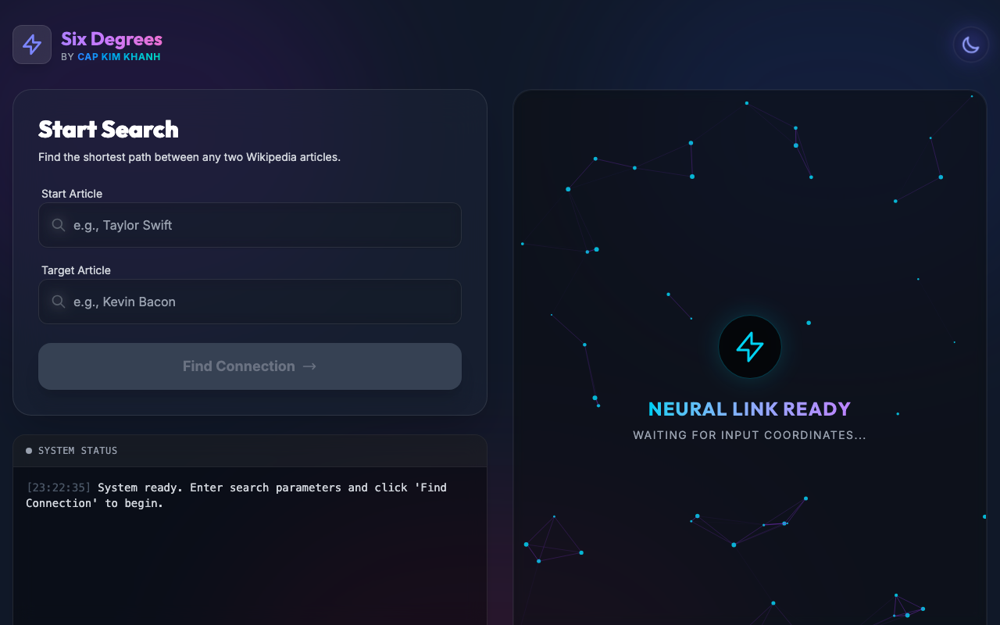
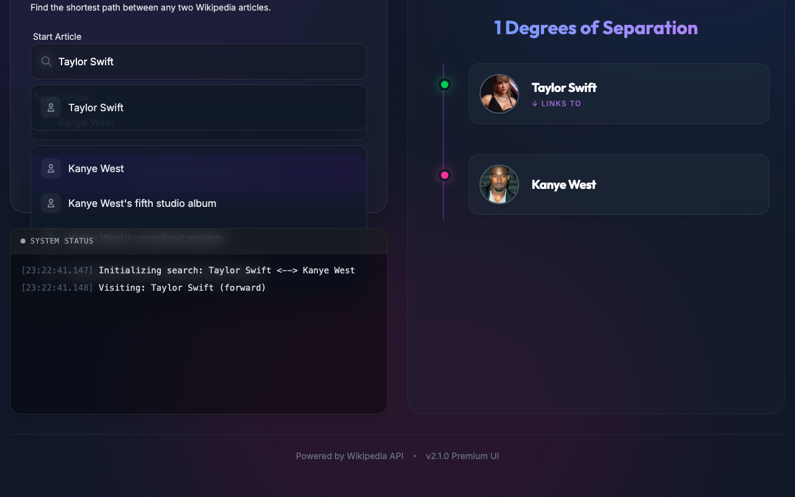

# 🌐 Six Degrees of Separation - AI Enhanced

> **Discover the hidden connections between any two people on Wikipedia using Bi-directional BFS and LLM-powered Entity Extraction.**


## 📖 Overview

**Six Degrees of Separation** is a sophisticated web application that explores the "small world" theory within the vast network of Wikipedia. By leveraging a **Bi-directional Breadth-First Search (BFS)** algorithm, it finds the shortest path between two people.

🚀 **New in v2.0**: We have integrated **Google Gemini AI** to revolutionize link extraction. Instead of relying on simple hyperlinks, our system now analyzes the *context* of the text to ensure connections are **factual, direct, and mutual**, filtering out mere comparisons or passing mentions.



## ✨ Key Features

- **🧠 AI-Powered Precision**: Uses LLMs to extract only valid relationships (Family, Co-stars, Rivals) and ignore noise.
- **⚡ High-Performance BFS**: Bi-directional search algorithm minimizes the search space for rapid results.
- **🔄 Async Architecture**: Built with `FastAPI` and `httpx` for concurrent, non-blocking Wikipedia API requests.
- **🎨 Immersive UI**: A stunning, dark-mode React interface with particle animations and a timeline visualization.
- **📜 Live Execution Log**: Watch the algorithm "think" in real-time with a detailed status console.

## 🎥 Demo

Watch the AI find a connection between **Taylor Swift** and **Kanye West**:

https://github.com/user-attachments/assets/demo.webm
*(Note: Video is stored locally in `assets/demo.webm`)*



## 🛠️ Tech Stack

### Backend
- **Language**: Python 3.8+
- **Framework**: FastAPI
- **AI Integration**: Google Generative AI (Gemini)
- **Networking**: httpx (Async HTTP)

### Frontend
- **Framework**: React (Vite)
- **Styling**: Tailwind CSS
- **Animations**: HTML5 Canvas

## 🚀 Installation & Setup

### Prerequisites
- **Python 3.8+**
- **Node.js 16+**
- **Google Gemini API Key** (Get one [here](https://aistudio.google.com/app/apikey))

### 1. Clone the Repository
```bash
git clone https://github.com/capkimkhanh2k5/SixDegreeOfSeparation.git
cd SixDegreeOfSeparation
```

### 2. Backend Setup
```bash
# Create virtual environment
python3 -m venv venv
source venv/bin/activate  # On Windows: venv\Scripts\activate

# Install dependencies
pip install -r requirements.txt
# Or manually: pip install fastapi uvicorn httpx google-generativeai python-dotenv

# Configure Environment Variables
# Create a .env file in the root directory
echo "GEMINI_API_KEY=your_api_key_here" > .env
```

### 3. Frontend Setup
```bash
cd frontend
npm install
```

## 🏃‍♂️ Running the Application

We provide a convenient script to start both services:

```bash
# From the root directory
./run.sh
```

Or run them manually:

**Backend:**
```bash
source venv/bin/activate
uvicorn backend.main:app --reload --port 8001
```

**Frontend:**
```bash
cd frontend
npm run dev
```

Access the application at: `http://localhost:5173` (or `http://localhost:8000` if using the unified server).

## 🎮 Usage Guide

1.  **Enter Start & End**: Type the names of two people (e.g., "Sơn Tùng M-TP" and "Snoop Dogg").
2.  **Initiate Search**: Click **"Find Connection"**.
3.  **Monitor Progress**: The Status Console will show the real-time crawling and AI filtering process.
4.  **View Results**: Once found, the path is displayed as an interactive timeline.

## 🤝 Contributing

Contributions are welcome! Please feel free to submit a Pull Request.

## 📄 License

This project is licensed under the MIT License.

---
*Designed & Developed by **CapKimKhanh***
