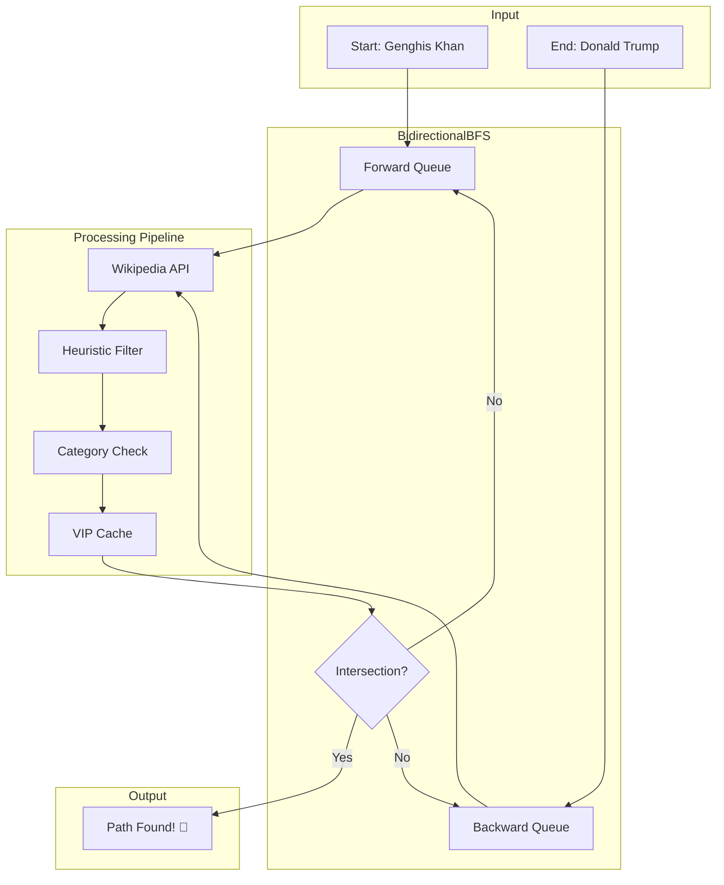

<p align="center">
  
</p>

<h1 align="center">🌐 Six Degrees of Wikipedia</h1>

<p align="center">
  <strong>Connecting History in Seconds</strong><br>
  <em>Find the shortest path between any two people on Wikipedia — from ancient emperors to modern CEOs.</em>
</p>

<p align="center">
  <a href="#introduction">Introduction</a> •
  <a href="#-key-features">Features</a> •
  <a href="#-performance-benchmarks">Benchmarks</a> •
  <a href="#-installation">Installation</a> •
  <a href="#-architecture--methods">Architecture</a> •
  <a href="#-project-structure">Project Structure</a>
</p>

<p align="center">
  
  
  
  
</p>

---

## Introduction

**What is Six Degrees of Wikipedia?**

This project implements the famous [Six Degrees of Separation](https://en.wikipedia.org/wiki/Six_degrees_of_separation) theory on Wikipedia — proving that any two people (historical or living) can be connected through a chain of hyperlinks in just a few hops.

**The Problem We Solve:**

Wikipedia contains **6.8+ million articles** with interconnected links forming an astronomical graph. Finding the shortest path between two articles is computationally expensive because each node expands exponentially:

| Depth | Nodes (Branching Factor = 100) |
|:-----:|-------------------------------:|
| 1     | 100                            |
| 2     | 10,000                         |
| 3     | 1,000,000                      |
| 4     | 100,000,000                    |
| 5     | **10 billion** 🔥              |

A naive BFS becomes infeasible beyond depth 3. Our solution uses **Bidirectional BFS** combined with **heuristic filtering** and **VIP hub caching** to solve even extreme historical cases in under 60 seconds.

---

## 🚀 Key Features

| Feature | Description |
|---------|-------------|
| 🧠 **Bidirectional BFS** | Searches from both ends simultaneously, reducing complexity from **O(b^d)** to **O(b^{d/2})**. For a 6-hop path with branching factor 100: Standard = 1 trillion nodes → Bidirectional = **2 million nodes** (500,000× faster). |
| ⚡ **Async High-Concurrency** | 15 concurrent API requests using `asyncio` + `httpx` for maximum throughput. |
| 🛡️ **Resilience (Watchdog/Timeout)** | Hard timeout (100s) + Soft timeout (98s) with graceful degradation. Never hangs, always returns. |
| 🎯 **Smart Person Filtering** | Two-stage filter using Wikipedia categories — reduces noise by **90-96%**. |
| 🌟 **VIP Hub Caching** | 100+ famous figures (politicians, scientists, tech leaders) are pre-validated for instant path discovery. |
| 💾 **Multi-Layer Caching** | Persistent JSON caches for pages, categories, and backlinks — repeated searches are near-instant. |

---

## 📊 Performance Benchmarks

Our algorithm has been battle-tested against increasingly difficult pathfinding challenges:

| Test Case | Start | End | Time | Hops | Difficulty |
|:---------:|:-----:|:---:|:----:|:----:|:----------:|
| 🟢 **Easy** | Barack Obama | Donald Trump | **~1s** | 2 | Modern presidents |
| 🟡 **Medium** | Elon Musk | Steve Jobs | **~20s** | 3 | Tech moguls |
| 🔴 **Extreme** | Genghis Khan | Donald Trump | **~55s** | 4 | 800-year time gap |

> **The Extreme Test:** Connecting a 12th-century Mongol Emperor to a 21st-century US President across 800 years of history — solved in under 60 seconds! 🎉

### Filtering Efficiency

```
Genghis Khan: 586 links → 569 (heuristic) → 52 humans (91% noise reduction)
Donald Trump: 2500 links → 2281 (heuristic) → 101 humans (96% noise reduction)
```

---

## 📦 Installation

### Prerequisites

- Python 3.10+
- Node.js 18+ (for frontend)

### Quick Start

```bash
# Clone the repository
git clone https://github.com/capkimkhanh2k5/SixDegreeOfSeparation.git
cd SixDegreeOfSeparation

# Create virtual environment
python -m venv .venv
source .venv/bin/activate  # Windows: .venv\Scripts\activate

# Install Python dependencies
pip install -r requirements.txt

# (Optional) Set up environment for LLM features
cp .env.example .env
# Edit .env with your Gemini API key
```

### Build Frontend (Optional)

```bash
cd frontend
npm install
npm run build
cd ..
```

---

## 🚀 Usage

### Run the Server

```bash
# Using the convenience script
./run.sh

# Or manually with uvicorn
uvicorn backend.main:app --reload --port 8000
```

Then visit **http://localhost:8000** in your browser.

### Run Benchmarks

```bash
# Full benchmark suite (Easy, Medium, Extreme)
python tests/benchmark_suite.py

# Quick search test
python -c "
import asyncio
from backend.bfs import find_shortest_path

async def main():
    async for msg in find_shortest_path('Barack Obama', 'Donald Trump'):
        print(msg)

asyncio.run(main())
"
```

---

## 🏗️ Architecture & Methods

### Core Components

| Component | File | Purpose |
|-----------|------|---------|
| **BidirectionalBFS** | `backend/bfs.py` | Main search engine with dual-queue BFS |
| **HeuristicFilter** | `backend/bfs.py` | Removes non-person pages before API calls |
| **VIP Allowlist** | `backend/bfs.py` | 100+ pre-verified famous humans |
| **Watchdog Timer** | Built-in | Hard timeout (100s) + Soft timeout (98s) |
| **AsyncClient** | `httpx` | High-concurrency HTTP with connection pooling |

### System Architecture



### How Bidirectional BFS Works

```
      START: Genghis Khan                   END: Donald Trump
               │                                    │
               ▼                                    ▼
     ┌─────────────────┐                 ┌─────────────────┐
     │ Forward Queue   │◄───────────────►│ Backward Queue  │
     │ (expand smaller)│                 │ (expand smaller)│
     └─────────────────┘                 └─────────────────┘
               │                                    │
               ▼                                    ▼
     ┌─────────────────┐                 ┌─────────────────┐
     │ Heuristic Filter│                 │ Heuristic Filter│
     │ (Remove junk)   │                 │ (Remove junk)   │
     └─────────────────┘                 └─────────────────┘
               │                                    │
               ▼                                    ▼
     ┌─────────────────┐                 ┌─────────────────┐
     │ Category API    │                 │ Category API    │
     │ (Verify humans) │                 │ (Verify humans) │
     └─────────────────┘                 └─────────────────┘
               │                                    │
               └───────────────┬───────────────────┘
                               │
                               ▼
                     ┌─────────────────┐
                     │ INTERSECTION!   │
                     │ Path Found! 🎉   │
                     └─────────────────┘
```

### Key Optimizations Explained

#### 1️⃣ Complexity Reduction

```
Standard BFS:       O(b^d)      →  For depth=6, b=100: 1 trillion nodes
Bidirectional BFS:  O(b^{d/2})  →  For depth=6, b=100: 2 million nodes

Speedup: 500,000× faster!
```

#### 2️⃣ Smart Pagination

```python
# Early exit when enough humans found
if potential_humans >= 25:
    break  # No need to fetch more pages
```

#### 3️⃣ Graceful Degradation

```python
# If API times out, fall back to VIPs + top candidates
try:
    return await check_categories(titles)
except asyncio.TimeoutError:
    return vips + others[:20]  # Never block the search
```

---

## 📁 Project Structure

```
SixDegreeOfSeparation/
├── 📂 backend/
│   ├── bfs.py           # 🧠 Core Bidirectional BFS engine
│   ├── main.py          # 🚀 FastAPI application
│   ├── llm_client.py    # 🤖 Gemini AI integration
│   └── text_utils.py    # 🔤 Name resolution utilities
│
├── 📂 frontend/
│   ├── src/             # ⚛️ React components
│   └── dist/            # 📦 Production build
│
├── 📂 tests/
│   ├── benchmark_suite.py   # 📊 Full benchmark tests
│   └── watchdog_benchmark.py # ⏱️ Timeout verification
│
├── 📂 assets/
│   └── logo.png         # 🎨 Project logo
│
├── wiki_cache.json       # 💾 Page links cache
├── category_cache.json   # 💾 Human verification cache
├── backlink_cache.json   # 💾 Backlinks cache
├── requirements.txt      # 📋 Python dependencies
└── run.sh               # 🏃 Quick start script
```

---

## 🤝 Contributing

Contributions are welcome! Here's how you can help:

1. **Fork** the repository
2. **Create** a feature branch (`git checkout -b feature/amazing-feature`)
3. **Commit** your changes (`git commit -m 'Add amazing feature'`)
4. **Push** to the branch (`git push origin feature/amazing-feature`)
5. **Open** a Pull Request

### Areas for Contribution

- [ ] Add more VIP hub nodes for faster convergence
- [ ] Implement path caching for common queries
- [ ] Add support for non-person entities (places, events)
- [ ] Improve frontend visualizations

---

## 📄 License

This project is licensed under the **MIT License** — see the [LICENSE](LICENSE) file for details.

---

## 🙏 Acknowledgments

- [Wikipedia MediaWiki API](https://www.mediawiki.org/wiki/API:Main_page) — for providing the data
- [Google Gemini](https://ai.google.dev/) — for AI-powered relationship explanations
- Inspired by [Six Degrees of Kevin Bacon](https://en.wikipedia.org/wiki/Six_Degrees_of_Kevin_Bacon)

---

<p align="center">
  <strong>Made with ❤️ by <a href="https://github.com/capkimkhanh2k5">capkimkhanh2k5</a></strong>
</p>

<p align="center">
  <em>⭐ Star this repo if you found it useful!</em>
</p>
